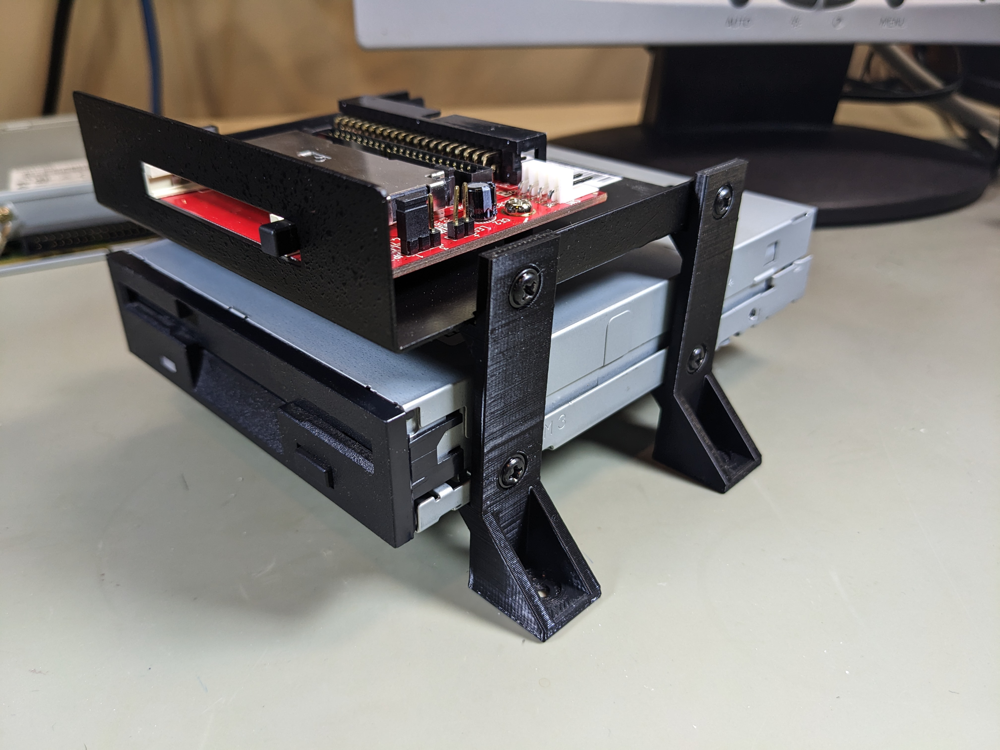
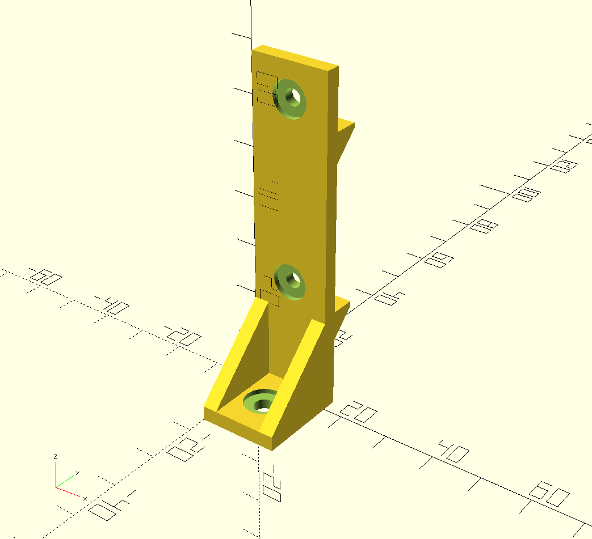

# 3D printed 3.5" drive mounting posts

This project provides a simple way to mount 3.5" devices such as floppy drives to a
horizontal surface. The current design supports two devices. Just print 4 copies,
and they become "legs" that attach to the drives using standard M3 machine
screws, and can be screwed down using \#6 machine screws (e.g., standard 6-32
PC case screws.)

The design is made using [OpenSCAD](https://openscad.org/), and has parameters
that can be easily adjusted.

Note that the STL file is included, but I can't guarantee that it's up to
date. I recommend generating the STL from the OpenSCAD source.

I sliced this design using Cura and printed it on a Creality Ender 3
using PLA with 40\% infill without rotating it.

## Images

Photo showing the mounting posts used with a 3.5" floppy drive and a StarTech
CompactFlash to IDE adapter:

Preview from OpenSCAD:

## License

This design is public domain. Feel free to use it as you see fit.

This work is marked with <a href="http://creativecommons.org/publicdomain/zero/1.0?ref=chooser-v1" target="_blank" rel="license noopener noreferrer" style="display:inline-block;">CC0 1.0</a>
 
